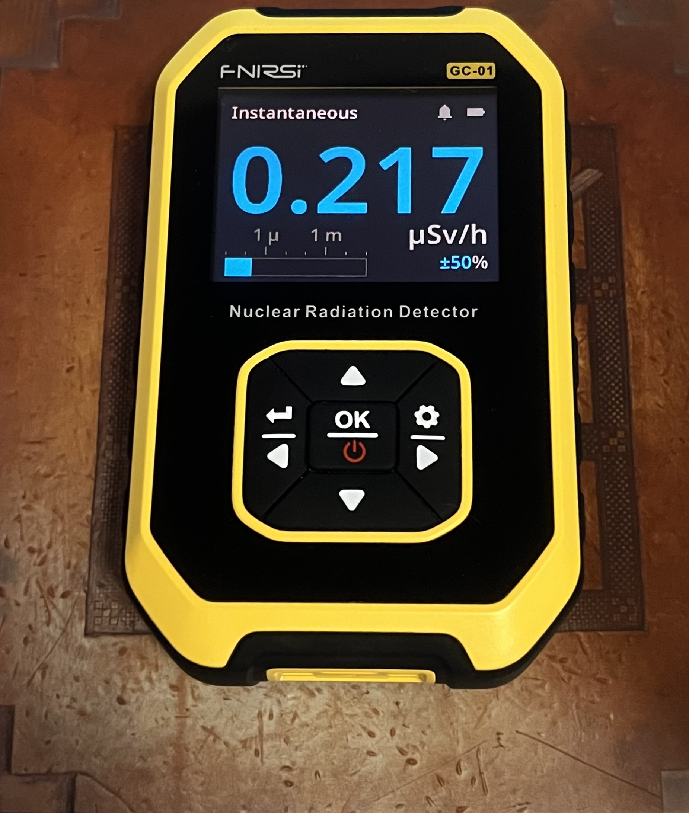
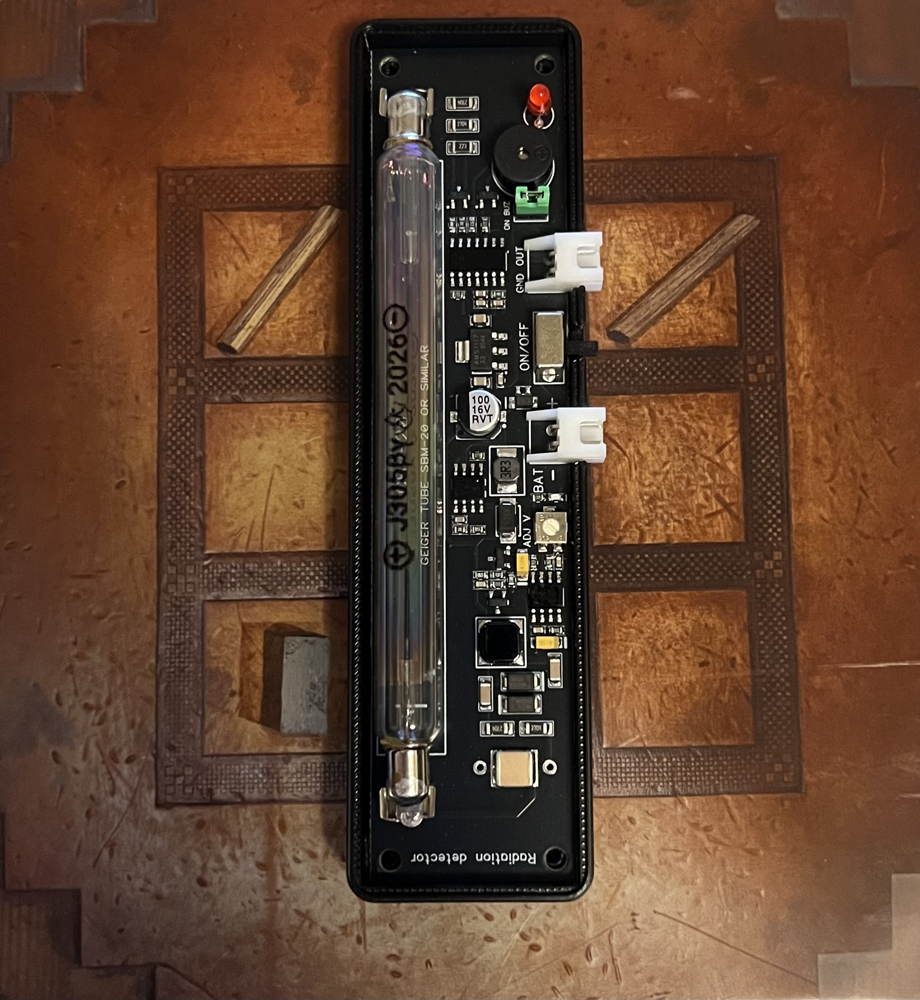
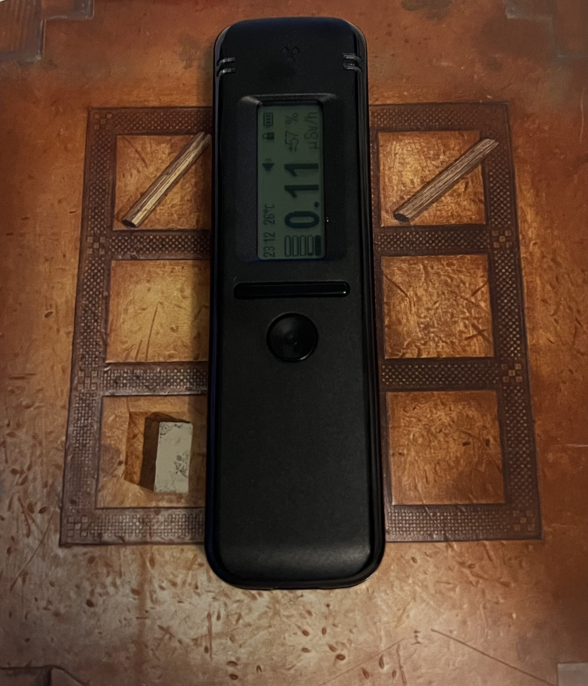

# Hardware

Work in progress Document.

This is the integrated picture of the physical set up that PROTON reads from: what the detector stack is, how hte pieces connect, and how the data reaches the computer. Each detector's own quick start lives in its respective package README under `proton/Hardware/Detectors/`. This file specifies the wiring, the topology, and the parts list so the details are easy to find in one place.

## The detector stack
 
| detector | role | how it connects | package |
| --- | --- | --- | --- |
| FNIRSI GC-01 | polled Geiger counter running Rad Pro | USB-C serial | `geiger_serial` |
| GGreg20_V3, J305 tube | per-pulse source for inter-arrival timing | jumper wires to an ESP32, then USB | `geiger_pulse` |
| Radiacode 102 | gamma spectrometer | USB-C, or Bluetooth on Linux | `gamma_spectrometer` |
 
<table align="center">
  <tr>
    <td align="center"></td>
    <td align="center"></td>
    <td align="center"></td>
  </tr>
  <tr>
    <td align="center"><b>FNIRSI GC-01</b> <code>geiger_serial</code></td>
    <td align="center"><b>GGreg20 + J305</b> <code>geiger_pulse</code></td>
    <td align="center"><b>Radiacode 102</b> <code>gamma_spectrometer</code></td>
  </tr>
</table>
 
## How the data reaches the computer

The GC-01 and the Radiacode are self-contained USB instruments, so each plugs straight into the host, wheras the GGreg20 is a bare sensor with no USB, so it is connected to an ESP32 over jumper wires, and the ESP32 will carry the data the rest of the way.

All together, every USB device plugs into one powered hub and the hub runs a single cable into the laptop. 

It is planned for the project to have a three ESP32 nodes in a mesh, spread out and published over WiFi to an MQTT broker instead, so the convergence point moves from the hub to the broker. 

## GGreg20  to ESP32 wiring

The GGreg20_V3 board exposes two 2-pin JST connectors.

