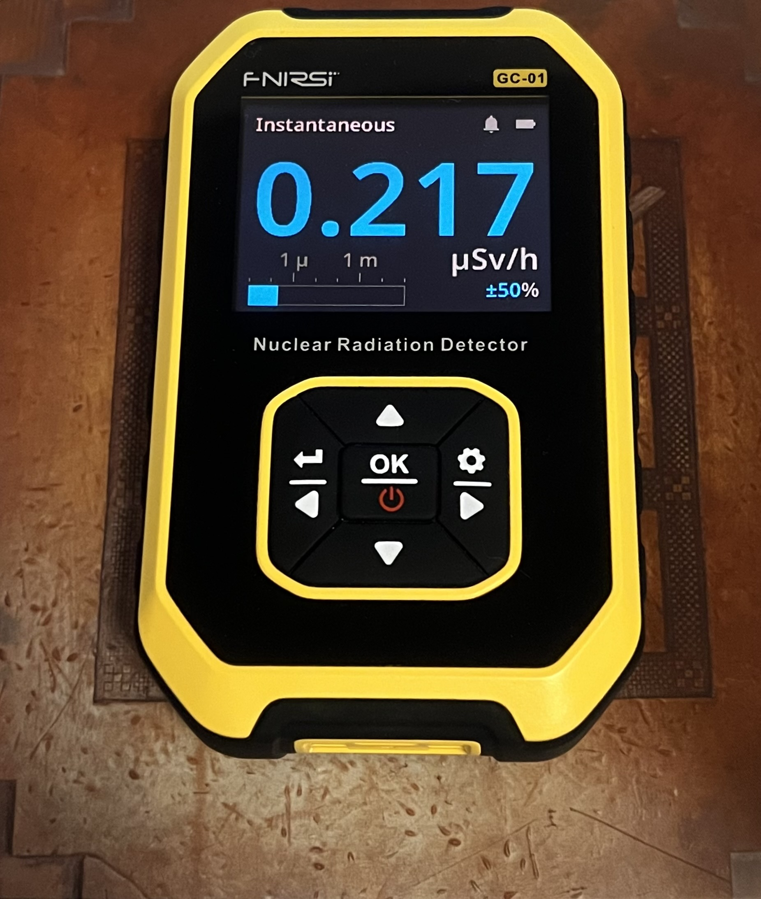
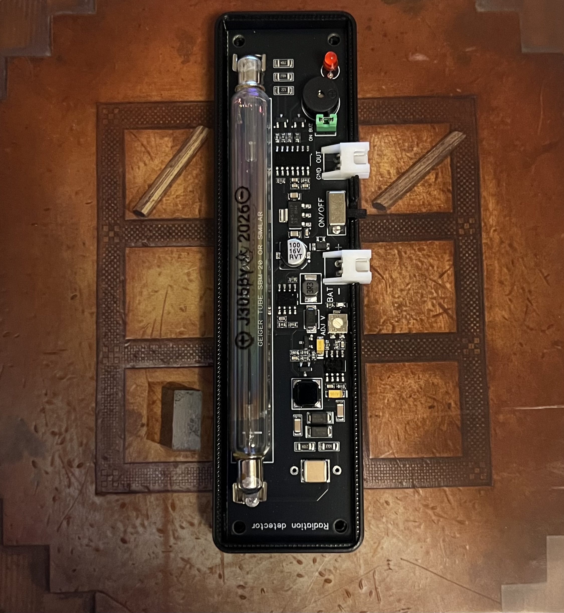
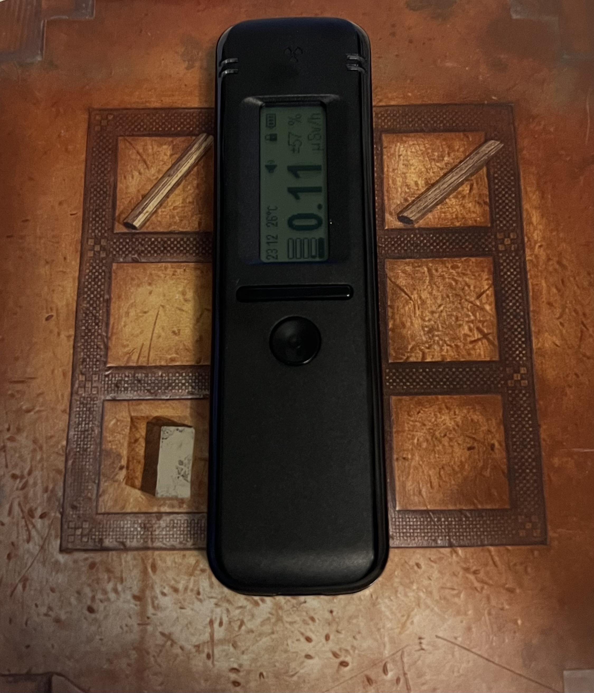
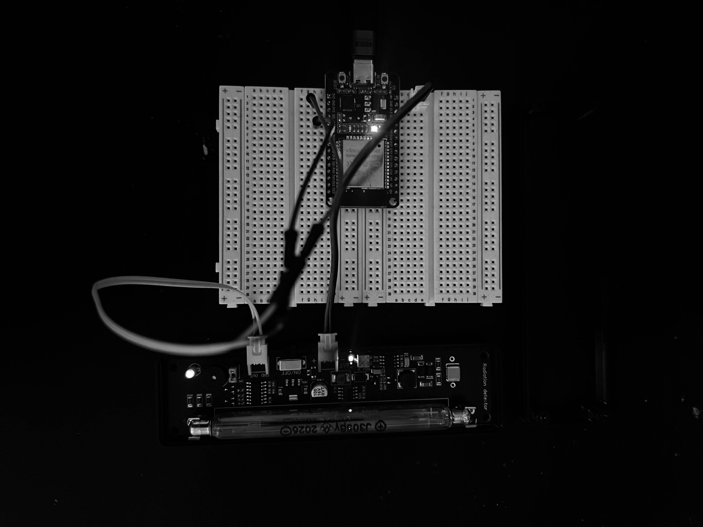
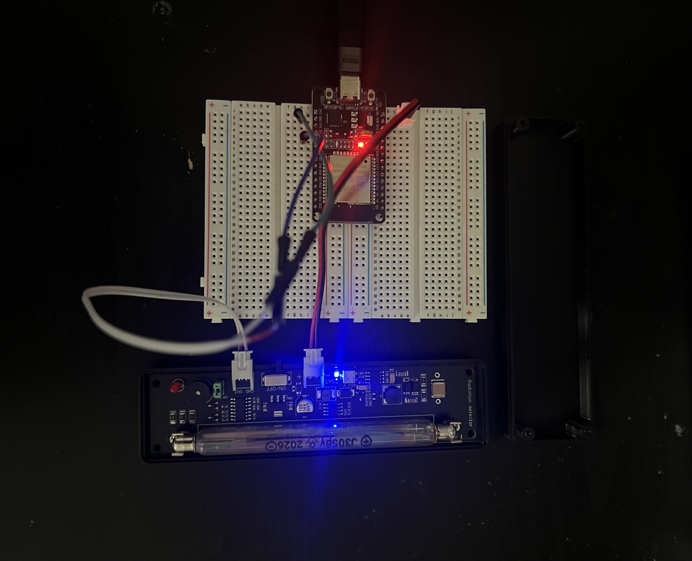

# Hardware

PROTON supports the use of hardware for the data aquisition process to feed into PROTON itself. This document specifies how to use hardware with PROTON, providing examples with devices that has built-in support already, and how to use alternative devices with PROTON. The example setup below (wiring, parts list, topology) is the rig I actually built, so copying it should get you running without much guesswork.

## General device classes and alternative detectors

If you're using one of the three supported types (a gamma spectrometer, or a geiger counter reading either counts or pulses), you're already covered. For anything else, each package also comes with a General Device Class that takes any read function you give it and treats it the same as the real hardware from there on. `data_handler.py` has what you need to wire in your own device if the built in supports are not sufficent enough to easily modify and extend to your own device.

## Data acquisition

Every detector package, general or specific, collects data the same way.

Each one has a `check_` script that reads a few samples so you can confirm the device is alive, and a `record_` script that writes a full run to a csv. The examples below use the pulse detector, but the counts and spectrometer packages work the same way.

```
# read a handful of samples to confirm the wiring works
python -m proton.Hardware.Detectors.geiger_pulses.check_pulses --count 20

# record a run to a csv
python -m proton.Hardware.Detectors.geiger_pulses.record_pulses --duration 3600 --name background_room
```

Parameters:

- `--duration` is how many seconds to record.
- `--name` is the output file name without the extension.
- `--dir` is the folder to write into.
- `--port` overrides the serial port (`/dev/ttyUSB0` on Linux, a `COM` name on Windows).
- `--count`, on the check scripts, is how many samples to read before quitting.

What gets collected depends on the detector. The pulse device records one row per detected pulse, with the gap in microseconds since the previous pulse. The counts device records a running pulse total and the tube rate on a fixed cadence. The spectrometer records a full energy histogram per snapshot. Either way, the specific and general classes write the same columns, so a replayed run looks the same as a live one downstream.


## Example of a Valid Hardware Setup

### The detector stack
 
| detector | role | how it connects | package |
| --- | --- | --- | --- |
| FNIRSI GC-01 | polled Geiger counter running Rad Pro | USB-C serial | `geiger_counts` |
| GGreg20_V3, J305 tube | per-pulse source for inter-arrival timing | jumper wires to an ESP32, then USB | `geiger_pulses` |
| Radiacode 102 | gamma spectrometer | USB-C, or Bluetooth on Linux | `gamma_spectrometer` |
 
</br>

<table align="center">
  <tr>
    <td align="center"></td>
    <td align="center"></td>
    <td align="center"></td>
  </tr>
  <tr>
    <td align="center"><b>FNIRSI GC-01</b><br><code>geiger_counts</code></td>
    <td align="center"><b>GGreg20 + J305</b><br><code>geiger_pulses</code></td>
    <td align="center"><b>Radiacode 102</b><br><code>gamma_spectrometer</code></td>
  </tr>
</table>

</br>
 
### How the data reaches the computer

The GC-01 and the Radiacode are self-contained USB instruments, so each plugs straight into the host, whereas the GGreg20 is a bare sensor with no USB, so it is connected to an ESP32 over jumper wires, and the ESP32 will carry the data the rest of the way.

All together, every USB device plugs into one powered hub and the hub runs a single cable into the laptop. 

It is planned for the project to have three ESP32 nodes in a mesh, spread out and published over WiFi to an MQTT broker instead, so the convergence point moves from the hub to the broker. 


### GGreg20 to ESP32 wiring

The GGreg20_V3 board exposes two 2-pin JST connectors. They are labeled on the
silkscreen, and they are physically identical, so check the labels before plugging
in. Feeding 5V into the output pin can damage the module.

- BAT: power in, marked + and -. This is the red and black cable.
- GND OUT: the pulse output. This is the white cable, red conductor is OUT, blank is GND.

I used a 30-pin ESP32 DevKit (DOIT DevKit V1). Three connections total, and everything
downstream reads only these:

| From (GGreg20)     | To (ESP32) | Notes              |
| ---                | ---        | ---                |
| OUT (white, red)   | D4         | the pulse line     |
| GND (white, blank) | GND        | signal ground      |
| BAT + (red)        | VIN        | 5V from the ESP32  |
| BAT - (black)      | GND        | power ground       |

Power the module from VIN, not 3V3. The module boosts to about 400V for the tube and
needs the 5V headroom to do it. The OUT line still idles at 3.3V because the module pulls
it up on its own, so D4 never sees more than 3.3V.

In the firmware, D4 is a plain INPUT with no internal pullup, and the interrupt fires
on the falling edge, since the module is active low. That falling edge is one detected
particle.

The power cable ends in a bare JST, so I used a small screw terminal adapter to get it
onto the breadboard cleanly. Bare stranded wire jammed into a breadboard hole frays and
gives intermittent contact, which is miserable to debug when the thing you are measuring
is already random.

Cover the tube while recording. The J305 bulb is transparent and responds to light as
well as radiation, so an uncovered tube picks up spurious counts under room lighting. The
cover blocks the light without meaningfully attenuating the background radiation, so the
counts reflect radiation alone. All the bundled recordings were taken with the cover on.

</br>
<table align="center">
  <tr>
    <td align="center"></td>
    <td align="center"></td>
  </tr>
  <tr>
    <td align="center"><b>GGreg20 + J305 wired to a 30-pin ESP32 DevKit</b><br>OUT to D4, powered from VIN, common ground. Shown without LED glare.</td>
    <td align="center"><b>The same setup, powered on</b><br>Cover removed to show the tube; recordings are made with it on.</td>
  </tr>
</table>
</br>

### Troubleshooting

Real hardware over real operating systems has sharp edges. Here are the ones I hit, per
detector, so you do not lose an afternoon to them.

#### geiger_counts

The GC-01 has to be running Rad Pro firmware for the serial data logging to work. Stock
firmware does not export the pulse data the same way.

If the Arduino monitor, a previous run, or anything else still holds the serial port
open, the recorder cannot open it and the error is not always obvious. Close everything
touching the port first. On Linux, `fuser /dev/ttyUSB0` tells you what is holding it.

#### geiger_pulses

Duplicate lines after flashing, on Linux. After I flash the ESP32 with arduino-cli, the
next serial read sometimes floods with the same line repeated thousands of times, far
faster than the baud rate could actually send it. It is not the sketch. The index
increments on every print, so a repeated index means the host read a stale buffer. It is
the CP2102 USB bridge left in a bad state by esptool's reset at the end of the upload. A
software reset with usb_modeswitch helped for a minute but did not hold. What reliably
fixes it is physically unplugging the USB cable and plugging it back in before recording.
So the rule is: after you flash, replug before you record. The monotonicity guard in
readout.py catches this if it slips through, it raises rather than writing a quarter
million garbage rows.

Occasional double counts under the dead time. About 7% of my pulses arrive as a second
edge roughly 158 microseconds after a real one, below the J305's 180 microsecond dead
time. The tube cannot fire twice that fast, so these are not particles, they are the
front end registering one event twice. I do not debounce them in firmware on purpose,
since that would also eat the short interval tail I want for later modeling. I keep them,
flag them, and remove them in analysis with deadtime.py. The check_pulses smoke test
reports how many sub dead time intervals it sees.

Board resets when the port opens. Opening the serial port toggles DTR and RTS, wired to
EN and GPIO0, so the ESP32 reboots and dumps bootloader garbage at 74880 baud into the
stream. readout.py sets dtr and rts false before opening to suppress this. If you write
your own reader, do the same, and skip any line that does not parse as two numbers.

#### gamma_spectrometer

USB permissions on Linux. pyusb cannot open the Radiacode without permission, so a plain user run fails with an access error. The quick confirmation is to run once with sudo. The clean fix is a udev rule, which also keeps your data files from being owned by root. Find your device IDs with lsusb, then:

```
echo 'SUBSYSTEM=="usb", ATTRS{idVendor}=="0483", ATTRS{idProduct}=="f123", MODE="0660", TAG+="uaccess"' | sudo tee /etc/udev/rules.d/99-radiacode.rules
sudo udevadm control --reload-rules
sudo udevadm trigger
```

Then unplug the Radiacode and plug it back in so the rule takes effect. Reloading alone
does not do it, it needs a physical replug.

Bluetooth permissions. bluepy usually needs elevated rights too, so Bluetooth may also
want sudo or a setcap on the bluepy helper. Get USB working first, then try Bluetooth
with `--mac`. For long runs I use the wired link anyway, it is steadier over hours.

Firmware version. The radiacode library needs firmware 4.8 or newer and the constructor
raises if yours is older. Update through the official app, or pass
ignore_firmware_check = True for a quick test.

### Reference data

The recordings bundled in `proton/default_data/` are the raw outputs from the instruments. Nothing is filtered or corrected in the stored files. For geiger_pulses that means the sub dead time artifacts are still present in the data, so the raw data stays complete and anyone can audit what the detector actually saw before data cleaning.

The corrections happen later during the data analysis, not in the recording. The dead time handling in `deadtime.py` reads a raw interval series and returns a corrected result without touching the original file, so the same raw recording can be re-corrected later if the dead time value changes. 
